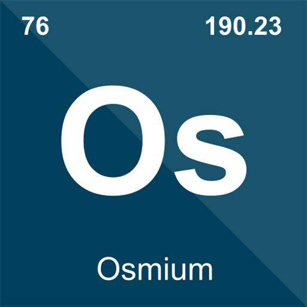
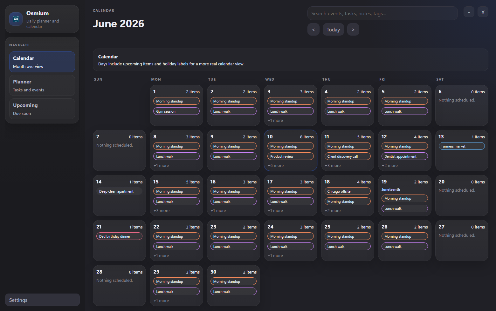
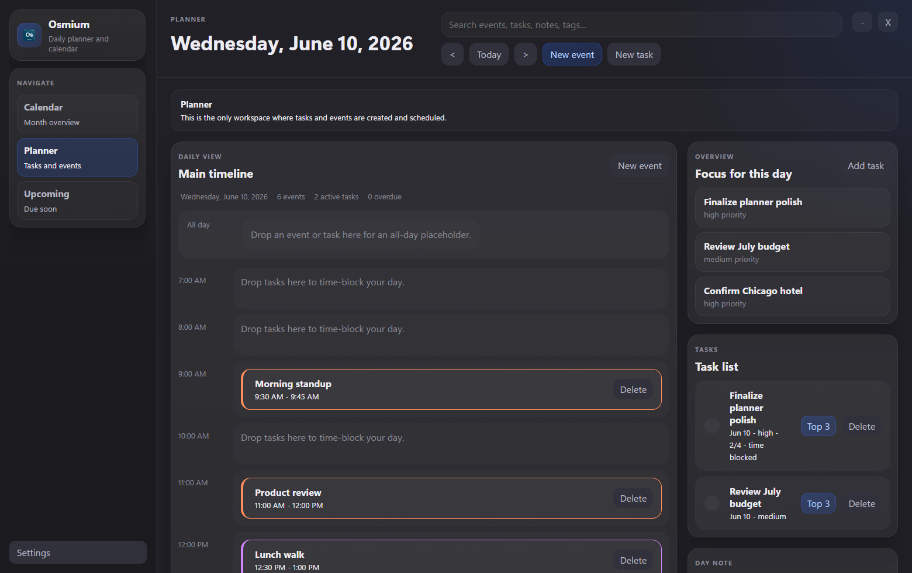
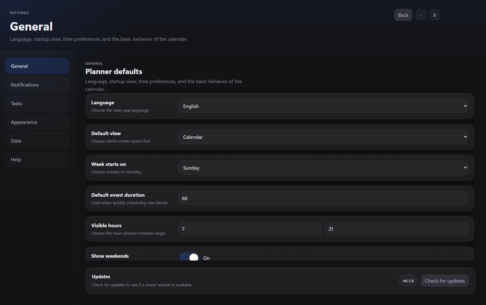

# Osmium

  

  A local-first desktop daily planner and calendar app for people who want structured days,
  flexible scheduling, and offline control over their tasks and events.

  
  
  
  
  

## What Is Osmium?

Osmium is a desktop daily planner and calendar app built as a sibling product to Iridium.

Your planner data stays on your machine. No internet connection is required, no account is required, and no cloud service is required to use the app.

## Why Use It?

- Your plans stay on your machine as local data you control.
- It works offline by default.
- It gives you a real calendar alongside a structured daily planner.
- You can manage events, tasks, time blocks, notes, and recurring routines in one place.
- It includes themes, settings, reminders, and a proper Windows/Mac installer.

## Features

- Local-first desktop app
- Daily planner with time blocking
- Monthly calendar with holiday labels
- Upcoming agenda view
- Event creation with reminders and repeat rules
- Daily tasks with priorities, notes, and subtasks
- Drag-and-drop scheduling for tasks and events
- Day notes and reusable planner templates
- Search across events, tasks, and notes
- Themes: Abyss, Dark, and Light
- Windows installer with configurable install path

## Download

Download the latest build from this repository:

**https://github.com/NaoWasTaken/Osmium/releases**

The packaged installer is named:

`Osmium_Setup_X.X.X.exe` for Windows\
`Osmium_Setup_X.X.X.dmg` for Mac

## Screenshots

### Calendar

### Planner

### Settings

## How To Use

1. Install Osmium from the packaged build.
2. Launch the app and start from the Calendar view.
3. Use Planner to add tasks, events, and time blocks.
4. Use Upcoming to review what is due soon.
5. Open Settings to change themes, reminders, backups, and planner defaults.
6. Keep your days organized with recurring events, priorities, and day notes.

## Who It Is For

Osmium is a good fit if you want:

- daily planning
- personal scheduling
- work and school organization
- deadline and bill tracking
- a local alternative to cloud-first planner apps

## Built With

- Electron
- React
- TypeScript
- Vite

## Project Goals

Osmium is built around a few core ideas:

- local-first by default
- clean, modern desktop planning UX
- fast day organization with low friction
- flexible scheduling without needing the internet
- one place for events, tasks, and daily notes

## Releases

Packaged builds and workflow artifacts live in:

**https://github.com/NaoWasTaken/Osmium/releases**

## Author

Built by **naowastaken**.
